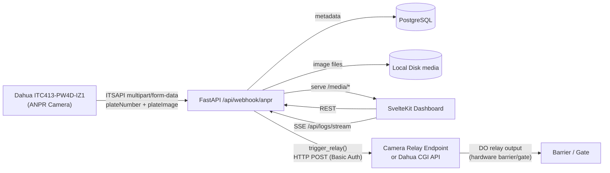

# Stack and Data Flow Diagram

## Components

- Backend: FastAPI + SQLAlchemy async + PostgreSQL
- Frontend: SvelteKit Node adapter + Tailwind CSS + svelte-i18n
- Real-time: Server-Sent Events for logs stream
- Storage split:
  - PostgreSQL for auth, vehicles, access metadata, relay jobs, webhook events
  - Local disk volume for image artifacts under media/YYYY/MM/DD/

## Camera: Dahua ITC413-PW4D-IZ1

- 4 MP CMOS, motorized varifocal 2.7–12 mm, IR 850 nm
- ANPR via deep learning: ≥96% plate recognition rate
- Pushes events via **ITSAPI** (HTTP `multipart/form-data` to configured URL)
- Payload fields: `plateNumber`, `plateImage`, `channelName`, `dateTime`, `country`, `plateColor`, `vehicleColor`, `vehicleType`, `vehicleBrand`, `direction`, `speed`
- 2× hardware relay DO outputs (30 V DC / 0.5 A) for direct barrier control
- On-camera whitelist/blacklist (110k entries) — **not used**; all decisions made in backend
- MicroSD local storage fallback (up to 256 GB) for network-loss scenarios
